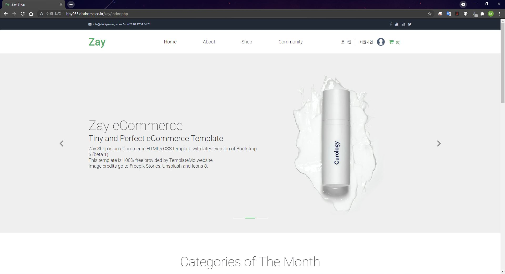
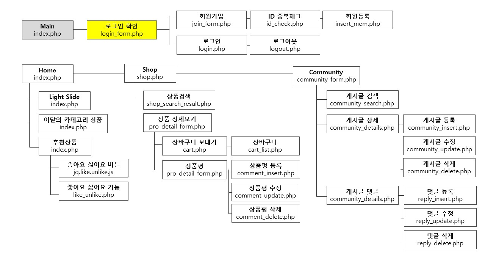

# Database-Project - zay

## Overview 😎

php를 활용해 구축된 전자상거래 홈페이지 입니다.  Database를 통해 상품 등록, 장바구니, 회원관리 등 전자상거래를 위한 기본적인 기능을 제공하고 있습니다.
홈페이지 구축을 위해 사용된 Datatbase의 Structure은 아래 링크를 통해 확인 부탁드립니다. 

호스팅 링크 : [http://hby033.dothome.co.kr/zay/index.php](http://hby033.dothome.co.kr/zay/index.php)

## Requirement

- HTML
- CSS
- Javascript
- [Jquery 3.6.0](https://code.jquery.com/)
- PHP
- MySQL

## Plugin

- Light Slide plugin

## Function

1. 로그인
2. 회원 사진 등록
3. 상품 사진 및 설명 등록
4. 상품 상세페이지
5. add to cart
6. like, unlike
7. 비밀번호 암호화
8. 상품평 등록
9. 상품 필터링(최신순, 좋아요 순 정렬)
10. 게시판
11. 답글
12. 게시판 넘버링
13. 게시판 조회
14. 게시판 수정 및 삭제
15. 관리자 페이지
16. 상품 검색

## Database Structure Table

- sql data Structure : [https://docs.google.com/spreadsheets/d/1vi38XBYAtltPcOQIyMoquw2v4QhyJU5NftpKK7wQcqg/edit?usp=sharing](https://docs.google.com/spreadsheets/d/1vi38XBYAtltPcOQIyMoquw2v4QhyJU5NftpKK7wQcqg/edit?usp=sharing)

